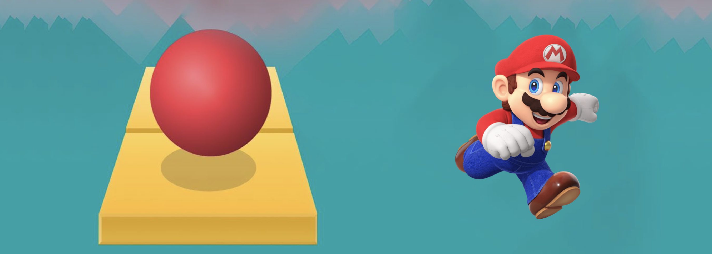

# Mario Rolling Sky 3D Game

(English version in [README_en.md](README_en.md))

En aquest repositori podeu trobar la implementació i documentació d'un joc Unity 3D que pretén ser un tribut al popular joc Rolling Sky combinat amb l'univers Mario.

## Autors i context

Aquest projecte ha estat desenvolupat pels usuaris [@arnauarque](https://github.com/arnauarque) i [@danielesquina](https://github.com/danielesquina) com a part de l'assignatura de [Videojocs](https://www.fib.upc.edu/ca/estudis/graus/grau-en-enginyeria-informatica/pla-destudis/assignatures/VJ) del [Grau en Enginyeria Informàtica](https://www.fib.upc.edu/ca/estudis/graus/grau-en-enginyeria-informatica) cursat a la Facultat d'Informàtica de Barcelona (Universitat Politècnica de Catalunya).

## Organització del repositori

- El directori [MarioRollingSky](game/MarioRollingSky) conté el projecte Unity (versió 2019.2.11f1) amb els scripts, models i prefabs (entre d'altres) necessaris per editar o previsualitzar el joc. 
- El fitxer [report.pdf](reports/report.pdf) conté una memòria on s'enuncien els objectius, la motivació, la metodologia i les conclusions del projecte. A més a més, s'inclou una descripció acurada dels objectius, les instruccions i el procés de confecció dels models 3D (tiles, entitats, funcionalitats, etc.) del joc. 
- S'inclou un [Package](game/MarioRollingSkyMac.app) compatible amb macOS Ventura que conté una versió funcional del joc.
- Per acabar, hem afegit un [vídeo](others/demo.avi) com a previsualització i demostració del funcionament de la versió final del videojoc. 
- En aquest mateix repositori podeu trobar versions en anglès del [report](reports/report_en.pdf) i del [README](README_en.md).

## Altres comentaris

Podeu trobar informació detallada del joc creat al [report](reports/report.pdf) inclós en aquest mateix directori. En aquest s'especifica com s'ha construit i desenvolupat el projecte, així com les **instruccions** per jugar al videojoc resultant. També s'inclouen totes les mencions i citacions necessaries tant del programari emprat com dels autors d'alguns dels models emprats en el videojoc. 

## Llicència

[![CC BY-NC-SA 4.0][cc-by-nc-sa-shield]][cc-by-nc-sa]

Aquest projecte ha estat desenvolupat amb propòsits exclusivament acadèmics. S'acull a la llicència  
[Creative Commons Attribution-NonCommercial-ShareAlike 4.0 International License][cc-by-nc-sa] (vegeu [LICENSE.txt](LICENSE.txt)).

[![CC BY-NC-SA 4.0][cc-by-nc-sa-image]][cc-by-nc-sa]

[cc-by-nc-sa]: http://creativecommons.org/licenses/by-nc-sa/4.0/
[cc-by-nc-sa-image]: https://licensebuttons.net/l/by-nc-sa/4.0/88x31.png
[cc-by-nc-sa-shield]: https://img.shields.io/badge/License-CC%20BY--NC--SA%204.0-lightgrey.svg
